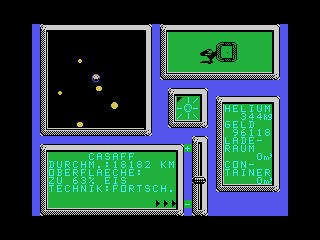

# 99er_games - old games for the TI-99/4A

This is a collection of games from digitizing my old tapes for the
original [TI-99/4A](https://en.wikipedia.org/wiki/TI-99/4A) home computer.
They are generally written in TI Extended Basic and can, for example,
be tried out with the [js99er](https://js99er.net) online emulator.

Where possible, I try to provide .tifiles for direct upload to an
emulator as well as text listings. For now, game dialogs are
generally in German.

Tape decoding was done using [ti99_4a_tape_decode](https://github.com/dimhoff/ti99_4a_tape_decode).

## Animalia

Not fully completed, and may abort with an error in some places:
a trading simulation that was somewhat inspired by Elite,
but without the real-time space battles. The backstory was
intended to be around interplanetary trade in exotic animals. Some
interesting aspects of the game would have been:

* Procedurally generated planet descriptions (using RNG seeds)
* Planets can be inhabited and offer you docks to upgrade your spaceship
  and a market buy and sell animals, or they can be uninhabited, allowing you to
  mine for raw materials and hunt for animals.
* As you add more equipment to your spacecraft, you can watch its appearance
  change on your screen

## Desktop Fighters

Published in TI Revue magazine (Germany): a two-play turned based strategy
game with a goal of occupying as many planets as possible with fleets
of spacecraft. Different types of craft determine the speed at which a fleet
can move, as well as its offensive and defensive capabilities. To balance
speed and firepower, fleets can be split up and moved independently.

This was my first attempt at implementing a "Mac-like" desktop environment
with overlapping windows in Extended Basic. One detail I remember is that
I used horizontal stripes rather than the usual checkerboard pattern for
the grey background to avoid an audible "hum" that was created on my TV
by high spatial frequencies.

Loading and saving game states to tape is also supported.

## Super Laser War

Platform game pitting the player against a single robot, mainly requiring
a good timing of placing the shot at the right distance while running at
the enemy. Movement can be controlled with user-defined keys for left,
right and fire, and by using holes in the ground as well as an elevator
for changing floors.
